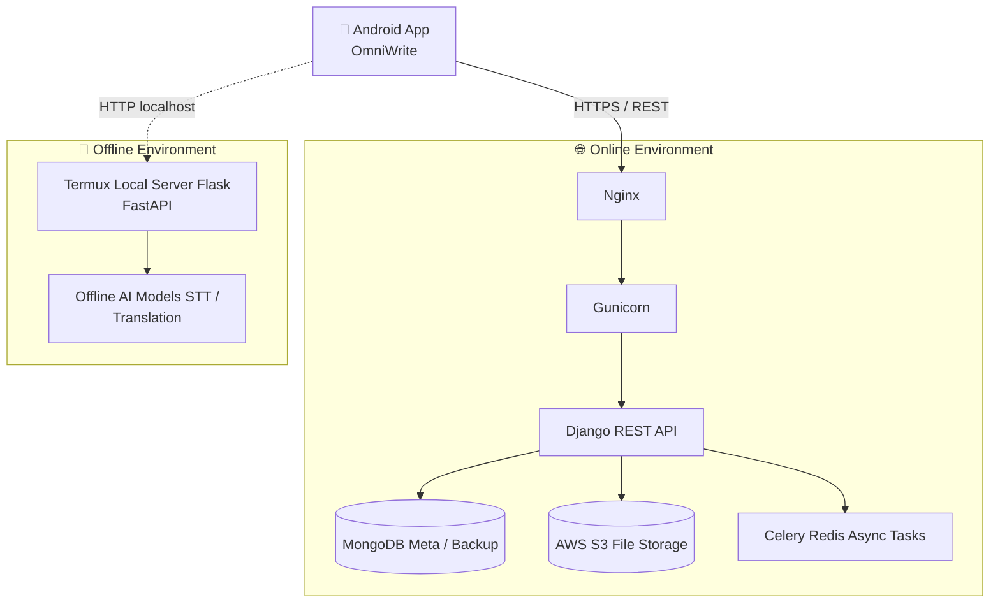

# 📝 TUK-CE (OmniWrite)
**Tablet PC용 학습 및 필기 지원 플랫폼**


필기(PDF 기반) + OCR + 요약 + 번역 + STT 기능을 하나의 앱으로 통합하고, **온라인/오프라인 환경 모두에서 동작**할 수 있도록 설계한 한국공학대학교 종합설계2 캡스톤 프로젝트입니다.

> 🎓 **한국공학대학교 종합설계2 S1-6팀** > 📅 **최종 발표:** 2025.08.31
<br>
> 🎓 **졸업논문** > [바로가기](https://github.com/cutiepepe2926/TUK-CE/blob/master/%EC%A1%B8%EC%97%85%EB%85%BC%EB%AC%B8%20S1-6(%EC%9D%B4%EA%B1%B4%ED%9D%AC%2C%20%EC%9D%B4%EA%B2%BD%ED%9B%88%2C%20%EB%A5%98%EC%8A%B9%ED%95%98%2C%20%EC%A0%84%EC%A4%80%ED%98%B8).pdf)

---

## 📑 목차
- [프로젝트 소개](#-프로젝트-소개)
- [주요 기능](#-주요-기능)
- [시스템 아키텍처](#-시스템-아키텍처)
- [기술 스택](#-기술-스택)
- [프로젝트 구조](#-프로젝트-구조)
- [데이터 포맷](#-데이터-포맷)
- [실행 방법](#-실행-방법)
- [API 개요](#-api-개요)
- [팀원 및 역할](#-팀원-및-역할)

---

## 💡 프로젝트 소개
태블릿 기반 필기 사용은 지속적으로 증가하고 있지만, 기존 필기 앱은 단순 “필기” 기능에만 머무는 경우가 많아 **요약, 번역, STT 같은 학습 보조 기능을 위해 외부 앱을 오가야 하는 불편함**이 존재합니다.

본 프로젝트는 이러한 문제를 해결하기 위해 아래의 기능들을 **하나의 앱**으로 통합하는 것을 목표로 합니다.
- **PDF 기반 필기 및 문서 관리**
- **OCR 기반 텍스트 추출**
- **요약 / 번역 / STT 등 AI 학습 보조 기능**
- **온라인 및 오프라인(네트워크 단절 환경) 모두 지원**

## ✨ 주요 기능

1. **📄 PDF 기반 필기/노트**
   - PDF 불러오기 또는 빈 PDF 생성 후 필기 지원
   - 메인 화면에서 노트 목록(생성/삭제/이름 변경) 관리
   - PDF 첫 페이지를 썸네일로 렌더링하여 직관적인 카드 형태로 표시
2. **📁 필기 데이터 관리 (`.mydoc`)**
   - PDF + 필기 스트로크 + 텍스트 주석(OCR 결과 등)을 단일 압축 파일(`.mydoc`)로 저장 및 복원
   - 기기 내부 저장소 기반의 안전한 파일 관리
3. **🔍 OCR (텍스트 추출)**
   - 이미지 및 화면 내 텍스트 인식 (한국어/영어 지원)
   - 크롭(영역 지정) 후 텍스트를 추출하여 요약/번역 등에 즉시 활용
4. **📝 AI 요약 (온라인, 비동기)**
   - PDF 파일과 페이지 범위를 서버로 업로드하여 요약 요청
   - 비동기 처리(`task_id` 기반)를 통해 요청 후 다른 작업 수행 가능
5. **🎙️ STT (온라인/오프라인 자동 분기)**
   - **온라인 STT (비동기):** 음성 파일 업로드 → `task_id`로 백엔드 결과 조회
   - **오프라인 STT:** 네트워크 미연결 시 **로컬 Termux 서버(127.0.0.1)**로 파일 전송 → 즉시 결과 수신
   - 앱 내부에서 네트워크 상태를 감지하여 최적의 경로로 자동 분기

<br>

## 🏗 시스템 아키텍처




## 🛠 기술 스택

### Android (Client)
- **Language:** Kotlin
- **UI & Architecture:** ViewBinding
- **PDF Handling:** android-pdf-viewer (Pdfium 기반), iText
- **Network:** Retrofit, OkHttp
- **AI & Processing:** Google ML Kit (OCR), uCrop (Image Cropping)
- **앱 최소 지원 버전:** Android 14 이상

### Backend (Online Server)
- **Environment:** Ubuntu, Nginx, Gunicorn
- **Framework:** Django, Django REST Framework
- **Database:** MongoDB
- **Async Processing:** Celery

---

## 📂 프로젝트 구조
상위 레벨에서 Android 앱(`app`)과 Django 백엔드(`merged_omniwrite`)를 함께 포함하는 모노레포 형태입니다.

```text
.
├── app/                      # Android 클라이언트 (Kotlin)
│   └── src/main/java/com/example/test_app
│       ├── MainActivity.kt
│       ├── SttActivity.kt
│       ├── SummarizeActivity.kt
│       ├── utils/            # MyDocManager, PdfUtils 등
│       └── model/            # Note, Stroke 데이터 클래스
│
├── merged_omniwrite/         # Django 백엔드 서버
│   ├── config/               # 개발/배포 설정
│   ├── accounts/             # 회원가입/로그인 (Auth)
│   ├── files/                # 파일 업로드/다운로드
│   ├── stt/                  # STT 비동기 처리
│   └── documents/            # 텍스트 데이터 처리
│
└── build.gradle.kts / settings.gradle.kts
```
## 📦 데이터 포맷

### `.mydoc` 파일 구조
필기 및 문서 데이터는 내부적으로 ZIP 포맷인 `.mydoc` 확장자를 사용하며 다음을 포함합니다:
- `base.pdf` : 원본(또는 현재) PDF
- `strokes.json` : 필기 Stroke 목록 데이터
- `annotations.json` : 텍스트 주석 (OCR 결과 등)

### 로컬 노트 목록 저장
앱 내부 저장소에 `notes.json` 형태로 노트 메타데이터를 저장하고 복원합니다.

---

## 🚀 실행 방법

### Android 앱
- **요구사항:** Android Studio (Meerkat 이상 권장), JDK 11, Android 14+ 기기 또는 에뮬레이터
1. 본 저장소를 클론한 후 Android Studio로 엽니다.
2. Gradle Sync를 완료하고 `app` 모듈을 실행합니다.

> **💡 URL 설정:** > - 기본 API Base URL은 `RetrofitClient.kt`에서 관리합니다.
> - 오프라인 STT 로컬 서버 URL은 `SttActivity.kt` 내 `127.0.0.1` 기준으로 동작합니다.

### 온라인 백엔드 서버 (`merged_omniwrite/`)
- **요구사항:** Python 3.x, MongoDB, ffmpeg(STT용)
- **환경 구축 및 실행:**

```bash
cd merged_omniwrite

# 1. 가상환경 세팅 및 의존성 설치
python -m venv .venv
source .venv/bin/activate
pip install -r requirements.txt # (환경에 맞게 구성 필요)

# 2. 환경 변수(.env) 세팅
# SECRET_KEY=...
# DEBUG=True
# MONGO_URI=mongodb://localhost:27017/omniwrite?authSource=admin

# 3. 마이그레이션 및 실행
python manage.py migrate
python manage.py runserver 0.0.0.0:8000
```
> *(운영 환경 배포 시 Nginx ↔ Gunicorn ↔ Django 구조를 권장합니다.)*

### 오프라인 로컬 서버 (Termux)
디바이스 오프라인 STT를 수행하려면 기기 내부(Termux 등)에 로컬 서버가 구동되어야 합니다.
- **예상 API 스펙:**
  - `POST http://127.0.0.1:8000/upload` (multipart form-data: `file`)
  - **Response:** `{"stt_result": "인식 결과 텍스트"}`

---

## 🌐 API 개요
앱에서 사용하는 주요 API 엔드포인트 예시입니다. (`BASE URL: /api/`)

| Domain | Method | Endpoint | Description |
|:---:|:---:|---|---|
| **Auth** | `POST` | `/users/signup/` | 회원가입 |
| | `POST` | `/users/login/` | 로그인 |
| | `POST` | `/users/token/refresh/` | 토큰 갱신 |
| **STT** | `POST` | `/stt/` | 음성 파일 업로드 (비동기) |
| | `GET` | `/stt/result/{task_id}/` | STT 결과 조회 |
| **Summarize**| `POST` | `/summarize/pdf/` | PDF 요약 요청 (page range 포함) |
| | `GET` | `/summarize/result/{task_id}/` | 요약 결과 조회 |

> ⚠️ 백엔드 배포 환경에 따라 실제 엔드포인트는 달라질 수 있으며, 앱 내 Retrofit 인터페이스를 실제 서버 주소에 맞춰 수정해야 합니다.

---

## 👨‍💻 팀원 및 역할

| 이름 | 역할 및 담당 업무 |
|:---:|---|
| **이건희 (팀장)** | 오프라인 번역/STT 기능 구현, 안드로이드 AI 모델 실행 환경 구축, 내부 Flask 서버 통신 |
| **이경훈** | 필기 화면 및 필기 기능 구현, OCR 오프라인 모델 적용, 필기 데이터 구조 개발 |
| **류승하** | OCR 초기 프로토타입 구현, UI 개선 및 Figma 디자인 |
| **전준호** | 온라인 서버 아키텍처 설계, Docker 기반 배포 환경 구축, 요약 및 STT API 구현 |

---

## ⚠️ 주의사항
- 본 저장소는 캡스톤 프로젝트 데모 목적의 코드가 포함되어 있습니다. 실행 환경(서버 주소, 토큰, API 경로 등)은 로컬/배포 구성에 맞게 조정이 필요합니다.
- 오프라인 STT 기능은 단말기 내에 “로컬 서버(Termux 등)”가 정상적으로 구축되어 있어야 동작합니다.
- STT와 요약 기능은 대용량 처리를 고려하여 `task_id` 기반의 비동기 흐름으로 설계되었습니다.

